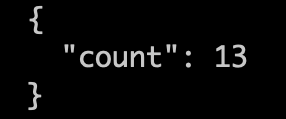
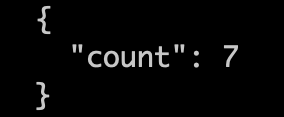
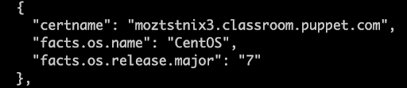
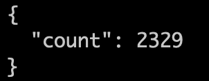
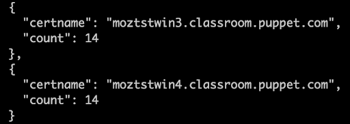
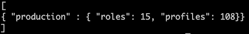
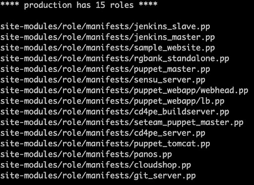
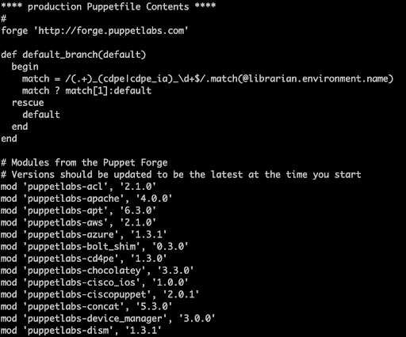

# Customer Success PE Quick Data

When seeking understanding, you might be asked by Puppet Customer Success to execute an information-gathering script. This script collects a large amount of system information, PE diagnostics, and high-level PuppetDB information.   After compiling the information, the module compresses the data, and prints the location of the zipped tarball when it finishes running.

The script is provided by the pe_quick_data module as a bolt plan that uses a set of tasks.   The pe_quick_data module primarily uses the [Puppet support script](https://puppet.com/docs/pe/latest/getting_support_for_pe.html) to build a profile of your environment.  Additionally, PuppetDB queries provide insight into the node configuration to better understand the overall landscape.  

# How is PE Quick Data Used

The data gathered is used to validate our customers are getting full value from their Puppet Enterprise install.   The gathering of the data allows the Puppet Solutions Engineer to take a look at how Puppet is being utilized, provide feedback, look at what improvements are possible and work with customers to get the most value from the installed Puppet Enterprise infrastructure and environments.  Puppet may also use the data to suggest additional Puppet products and services that may benefit you. 

In all instances, it will be used to collaborate better with our customers through verbal and/or written assessments. In addition, the data may be placed in an internal Puppet database to allow Puppet to report on improvements that have been identified or areas that may need improvement over time.

# PE Quick Data 

The following sections detail the specifics of the additional PuppetDB queries pulled from the PE stack.  These queries are in addition to the ‘puppet enterprise support’ command-line script that is also run during collection.  [Puppet support script ](https://puppet.com/docs/pe/latest/getting_support_for_pe.html)web page carefully documents all components captured during a support script run.

## Node Collection

The initial step of the PE Quick Data collection gathers a count of the nodes listed in the database that are active.  The count provides an accurate understanding of the overall size of the PE environment.   The next step captures the node quantity of the Windows and Linux operating systems.  These attributes provide a deeper insight into the diversity of systems under management with Puppet Enterprise.  Examples of node count and data collected are;

<table>
  <tr>
   <td>Active Node Counts

   </td>
   <td>Node Count by OS

   </td>
  </tr>
</table>

<table>
  <tr>
   <td>Basic Node Operating System Information

   </td>
   <td>Node Counts by Environment

   </td>
  </tr>
</table>

## Resources

Resources are the base abstractions used by Puppet to manage configuration management of systems.  

The quick data plan pulls details on the total quantity of managed resources across the estate and provides a count of resources on a node individual basis.  Both metrics provide an overview of the value of Puppet and more importantly the amount of complexity within the environment.  Resources are the building block used during catalog compilation and provide access to information that assists with recognizing potential performance issues and ideally where resource optimizations may be gained as a starting point.  Examples of the two items collected from resources are;

<table>
  <tr>
   <td>Resource Count Total

   </td>
   <td>Resources Count Total by Node (Certname)

   </td>
  </tr>
</table>

## Coding Practices

Puppet recommends workflows to enhance the development experience of our practitioners.  Two of the practices use code management, community modules, and role/profiles abstractions.

*   Roles and Profiles optimize the management of node classification and module minimization to reduce complexity.
*   Environments provide automated code management leading to an efficient testing and promotion workflow as practitioners make updates to their environments.
*   The Puppetfile lists the modules leveraged to ease the development of puppet code and ensures customers are maximizing their use of supported/contributed works.

The pe_quick_data module will pull the number of roles and profiles per environment by determining if there are any roles and profiles in the respective environments and finding the number of manifests in the roles and profiles directory.   The number of roles and profiles is capture in JSON format.   An example of the output is below;

The directory location of the roles and profiles is also placed into a text file for review as shown below;

   

As part of this effort, we are not gathering any Puppet DSL code contained within the manifest files, only that files exist in either role directory or profile directory.

This same process will also collect what environments are in the Puppet master purview.  This data assists in understanding if there are any optimizations or potential environment-related issues that we can help provide guidance on.

The last piece of additional information gathered as part of the pe_quick_data collection is a listing of the modules currently being retrieved through the Puppetfile and will include any modules listed in the Puppetfile.  This process also does not retrieve any Puppet DSL code in the modules, only that the modules are listed.  An example of the output is shown below;

